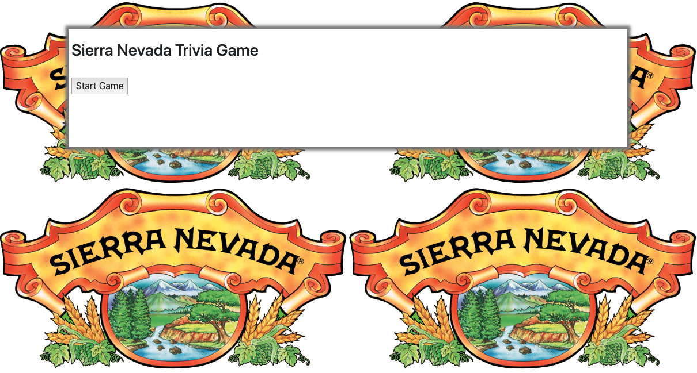
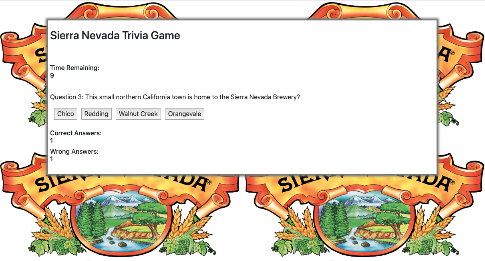
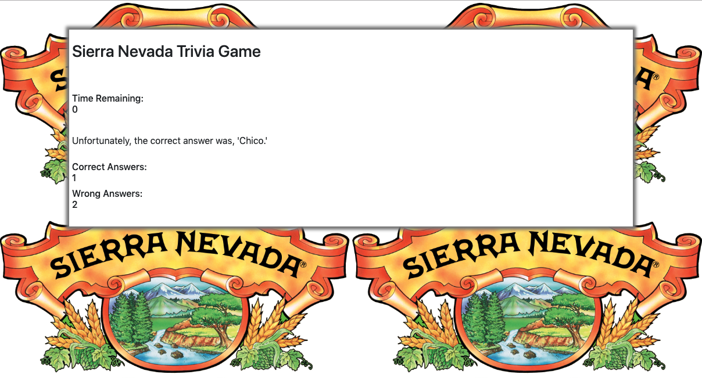
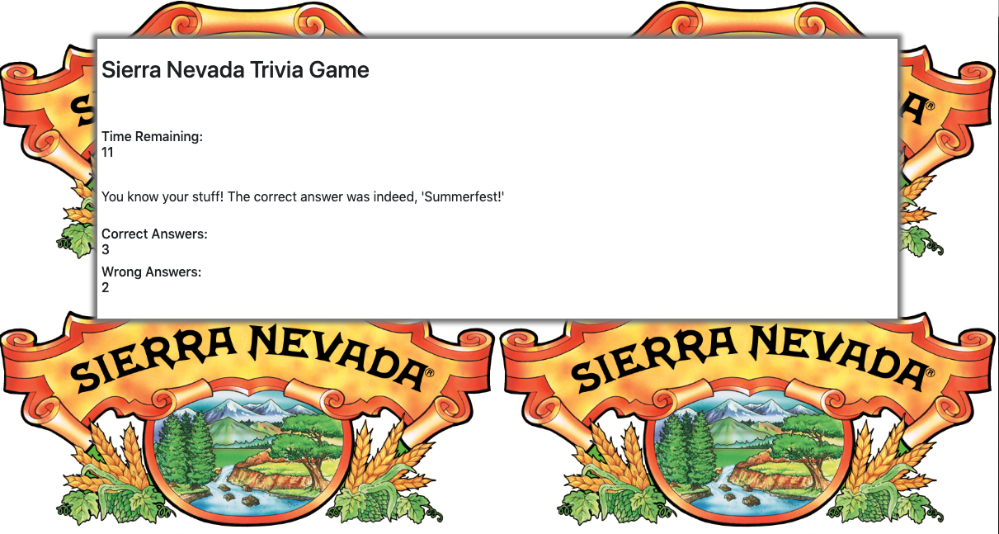
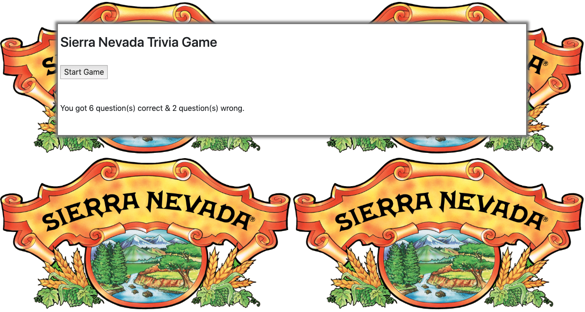

This is my submission for homework assignment number five: JavaScript Assignment #2. We were tasked with creating a trivia game that included a start button to begin the game, had specific timing decrements for each question, the option of separate correct & incorrect answer displays, and was able to restart without refreshing the browser. In order to accomplish this, we had to use our recent understanding of jQuery, JavaScript (specifically timing events & objects/ arrays), Bootstrap, HTML, & CSS. I chose to do the more difficult assignment this time around and while I found this assignment particularly challenging at first, I am thankful for the accumulation of knowledge that it brought me in the end. The theme of my trivia game is 'Sierra Nevada' because it's the greatest beer of all time, I previously worked for a public relations firm in which represented Sierra Nevada, & I was also fortunate enough to attend CSU Chico for my undergraduate degree.

Tech I Used:

[HTML](https://www.w3schools.com/html/)

[Bootstrap](https://getbootstrap.com/docs/4.3/getting-started/introduction/)

[CSS](https://www.w3schools.com/css/)

[JavaScript](https://www.w3schools.com/js/)

[jQuery](https://www.w3schools.com/jquery/)

Author: [Matthew Hagarty](https://github.com/matthewryanhagarty)